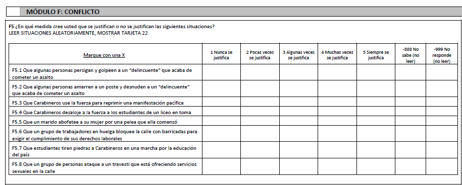

class: center, middle

# _Coloquio de investigación en desigualdad y ciudadanía - 2do Sem 2020_
```{r setup, include=FALSE,eval=TRUE}
options(htmltools.dir.version = FALSE)
```

```{r xaringan-themer, include=FALSE, warning=FALSE}
library(xaringanthemer)
style_duo(primary_color = "#1F4257", secondary_color = "#F97B64")

```

```{r, load_refs, include=FALSE, cache=FALSE}
library(RefManageR)
BibOptions(check.entries = FALSE,
           hyperlink = FALSE,
           dashed = FALSE)
myBib <- ReadBib("./Seminario.bib", check = FALSE)
```
---
class: inverse, center, middle

# Estructura de presentación

1. Contexto y motivación
2. Antecedentes: algunas nociones
3. Concepto principal y tipo de estudio
4. Pregunta
5. Datos, variables y método
6. A discutir

---
class: inverse, middle, center

# 1. Contexto y motivación

---
## 1.1 Contexto
Si bien la violencia ha sido muchas veces parte del debate publico (tanto por delicuencia como por protestas), es desde el **Estallido Social** que se torna un tema mediaticamente constante. Especialmente a raíz de la **radicalización de la protesta**, **las violaciones a derechos humanos** y la **brutalidad policial**.

--

## 1.2 Motivaciones

- *Personal*: tema de constante discusión en mis redes cercanas
- *Academica*: me da la impresión que el trabajo empírico en el tema podría ser una contribución
- *Formación*: aprender técnicas nuevas y usar datos recientes

---
class: inverse, middle, center

# 2. Antecedentes: algunas nociones

`r Citet(myBib, c("Willems2020"))`
---
class: inverse, middle, center

#  3. Concepto principal y tipo de estudio
---
## 3.1 Concepto principal: 
*Justificaciones de violencia*

---
## 3.1 Concepto principal

--

#### Dos tipos de violencia:

--
- **Violencia para el control social:** "aquellas situaciones en donde la violencia es ejercida por grupos dominantes-mayoritario por sobre grupos subordinados-minoritarios o cuando el objetivo de la violencia es el de reducir el potencial cambio en las estructuras normativas o jerarquicas de la sociedad" (Gerber et al., 2018, pp. 3-4, _traducción mía_)

--

- **Violencia para el cambio social:**  "aquellas situaciones en donde la violencia es ejercida por grupos subordinados-minoritarios por sobre grupos dominantes-mayoritarios o cuando el objetivo de la violencia es crear cambios en la estructura jerarquica o normativa de la sociedad" (Gerber et al., 2018, p.4, _traducción mía_)

---

## 3.2 Tipo de estudio:
- Exploratorio y relacional
- Cuantitativo con datos secundarios
- Análisis longitudinal y transversal.

---
class: inverse, middle, center

# 4. Preguntas

---
## 4.1 Preguntas

A grandes rasgos, las preguntas son:
- ¿Qué lleva a la gente a justificar la violencia?
- ¿Cómo esos factores cambian en el tiempo?

En consiguiente, propongo dos preguntas de estudio complementarias que se ajustan a mis intereses, al constructo y los datos disponibles:

--

### Pregunta longitudinal:
¿Cuáles son los factores que han influenciado los cambios en las justificaciones de justicia por el orden social y por el cambio social en la población chilena entre el 2016 y 2019?

--

### Pregunta transversal:
¿Cuáles son los factores que influyen en la justificación de violencia por el cambio social en la población chilena al año 2019?

---
class: inverse, middle, center

# 5. Datos, variables y método

---
## 5.1 Datos
Estudio Longitudinal Social de Chile (ELSOC) 2016-2019 (4 olas, se verá incluir la 5 de acuerdo a disponibilidad y tiempos).

---
## 5.2 Variables

--

### Dependiente

- Justificación de violencia por el orden social (F5.2 y F5.3)
- Justificación de violencia por el cambio social (F5.6 y F5.7) y (batería 2019)

_**Nota:** Medición a través de media simple para cada concepto y par de items._



---
## 5.2 Variables

### Independientes

--
#### Psicológicas

- *Orientación hacia la dominación social* (SDO, por sus siglas en inglés) y *Autoritarismo de derecha* (RWA, por sus siglas en inglés) (C18 y ¿C32?)
- **Sentido de (in)justicia** (M13 y M15)
- Sentido de justicia procesual en el actuar de la policía (no estoy seguro si está en los datos, ver batería 2019)

--

#### "Sociales"
- Nivel socioeconómico (a construir)
- Apoyo a movimientos sociales (C20 y C21)
- **Frecuencia de participación en movimiento de apoyo** (C22)
- Estatus Social Subjetivo (D1_1)
- Satisfacción con la vida (S1)

---
#### "Políticos"
- Confianza en instituciones (C5)
- **Legitimidad de la policía** (?)
- Posición política (izquierda, derecha, centro) (C15)
- Perfiles ideológicos COES (batería 2019)
- Satisfacción con la democracia (C1)
- **Participación política** (C8)
- Cambio constitución (C26-C29)

--

#### Socio-demográficos
- Sexo (M0_sexo)
- Edad (M0_edad)
- Nivel educativo (M1)
- Región/comuna (?)
- Pueblos indigenas (M53)
---
### Método de análisis longitudinal
Cross-Laged Panel Analysis

### Método de análisis transversal
Regresión lineal múltiple (o logistica dependiendo del tratamiento)

---
class: inverse, middle, center

# 6. A discutir
---

### ¿Apellido de "violencia"?
Violencia política, violencia colectiva, violencia intergrupal, violencia policial

--

### ¿Foco en grupos persona-manifestante/polícía?
Focalizarse solamente en ambos grupos dadas los items escogidos para la variable dependiente, o darle mayor abarcabilidad al concepto de **violencia por orden social** y abarcar la violencia en linchamientos (F5.1 y F5.2). O inclusibe darle mayor abarcabilidad al concepto de violencia mismo y abarcar también los otros dos tipos de violencia (F5.5 = violencia a la mujer-pareja y F5.8 = violencia a minorías sexuales)
---
### ¿Cómo hacer el enmarque discplinar del tema?
En especial desde la psicología, que es donde se ha trabajado bastante.

--

### ¿Abarcabalidad/complejidad del estudio?
¿Cómo determino la cantidad de predictores a introducir en los modelos (y por ende respaldar con literatura y discutir)?

--

### ¿Interacciones o mediaciones?
Ideas sobre interacciones o mediaciones que puedan ser necesarias incluir en la propuesta e hipotesis

---
class: inverse, middle, center

# ¡Muchas gracias!
---